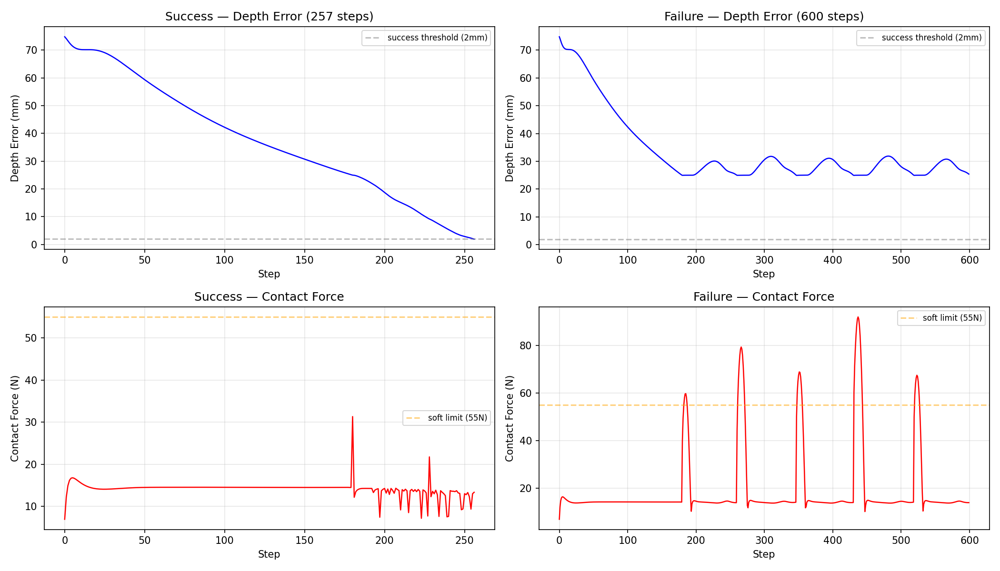

# Franka Residual RL — 代码详解

本文档面向学习用途，逐模块讲解整个项目的实现细节。

---

## 目录

1. [架构总览](#1-架构总览)
2. [MuJoCo 场景](#2-mujoco-场景)
3. [机器人模型 panda.xml](#3-机器人模型)
4. [逆运动学控制器](#4-逆运动学控制器)
5. [RL 环境 peg_in_hole_env.py](#5-rl-环境)
6. [策略网络 residual_policy.py](#6-策略网络)
7. [训练流程 train.py](#7-训练流程)
8. [评估与可视化](#8-评估与可视化)
9. [关键设计决策](#9-关键设计决策)

---

## 1. 架构总览


**两层控制器的分工：**
- **IK 底层**：负责 XY 平面对齐 + 姿态锁定，是一个解析的 Jacobian 伪逆控制器
- **RL 上层**：只输出 1 个值——z 轴速度，根据力反馈决定插还是退

为什么这样分？因为 XY 对齐是纯几何问题（已知孔坐标、已知末端位姿，直接算 Jacobian），而 z 轴插入需要力控（什么时候推、什么时候退、推多大），这个判断很难手写规则。

```
┌─────────────────────────────────────────┐
│                 SAC 策略                  │
│   输入: 6维观测 → 输出: 1维 v_z_cmd      │
│   负责: "什么时候推、什么时候退"          │
└──────────────────┬──────────────────────┘
                   │ v_z_cmd ∈ [-1, 1]
                   ▼
┌─────────────────────────────────────────┐
│         Resolved-Rate IK 控制器           │
│   输入: v_z_cmd + 孔位姿                  │
│   负责: XY 对齐 + 姿态锁定 + Z 跟踪       │
│   输出: 7 个关节位置指令                   │
└──────────────────┬──────────────────────┘
                   │ q_target (7维)
                   ▼
┌─────────────────────────────────────────┐
│           MuJoCo 物理引擎                │
│   Franka Panda + 36段圆孔场景            │
│   腕部 FT 传感器 → 力反馈                │
└─────────────────────────────────────────┘
```

---

## 2. MuJoCo 场景

文件：`assets/franka_panda/franka_emika_panda/scene_peg_in_hole.xml`


### 2.1 圆孔的实现

MuJoCo 没有"空心圆柱"几何体。用 36 个 box 拼成正多边形来近似圆柱内壁：

```xml
<!-- inner radius=11mm, peg radius=8mm => 3mm radial clearance -->
<body name="target_hole" pos="0.5 0 0">
  <!-- 底部 -->
  <geom name="hole_bottom" type="cylinder" size="0.014 0.005" pos="0 0 -0.005"/>
  <!-- 36 段墙壁，每 10° 一段 -->
  <geom name="wall_0" type="box" size="0.003 0.0025 0.02" pos="0.014 0 0.02" euler="0 0 0"/>
  <geom name="wall_1" type="box" size="0.003 0.0025 0.02" pos="0.01379 0.00243 0.02" euler="0 0 10"/>
  ...
</body>
```

**几何参数详解：**

| 参数 | 含义 | 值 |
|------|------|-----|
| `size="0.003 0.0025 0.02"` | box 半边长 (x, y, z) | 6mm厚 × 5mm宽 × 40mm高 |
| `pos="0.014 0 0.02"` | box 中心位置 | R=14mm 处，z=20mm |
| `euler="0 0 θ"` | 绕 z 轴旋转 | 让 box 切向圆 |

box 的 x 半长 3mm，中心在 R=14mm，所以内表面在 R=14-3=11mm（孔内半径）。外表面在 R=14+3=17mm。box 的 y 半长 2.5mm（宽 5mm），36 段在 R=14mm 的弧长约 2.4mm，足以完全覆盖，不留缝隙。

**36 段 vs 12 段：** 12 段（每 30° 一段）的孔肉眼可见多边形棱角，36 段（每 10° 一段）看起来就是圆的了。

### 2.2 力传感器

```xml
<sensor>
  <force name="ee_force_sensor" site="ft_sensor_site"/>
  <torque name="ee_torque_sensor" site="ft_sensor_site"/>
</sensor>
```

传感器绑定在 `ft_sensor_site`（panda.xml 中定义在腕部）。它测量的是腕部受到的力和力矩，通过刚体链传导，peg 尖端的接触力也会传递到这里。

### 2.3 接触排除

```xml
<contact>
  <exclude body1="left_finger" body2="target_hole"/>
  <exclude body1="right_finger" body2="target_hole"/>
</contact>
```

夹爪不参与碰撞检测（否则手指可能卡在孔边缘），只有 peg 尖端与孔壁碰撞。

---

## 3. 机器人模型

文件：`assets/franka_panda/franka_emika_panda/panda.xml`

### 3.1 关节驱动

Franka Panda 有 7 个旋转关节 + 2 个夹爪关节。

```xml
<actuator>
  <general name="joint1" joint="joint1" dyntype="none" biastype="affine"
           gainprm="1" biasprm="0 -1 -1" forcelimited="true" forcerange="-87 87"/>
  ...
</actuator>
```

关键参数：
- `dyntype="none"`：不使用 MuJoCo 内置的力动力学（电机模型为理想力矩源）
- `biastype="affine"`：`ctrl` 到力矩的映射为 `torque = gainprm * ctrl + biasprm[0] + biasprm[1]*qpos + biasprm[2]*qvel`
  - `gainprm="1"`：单位增益，ctrl 直接对应力矩
  - `biasprm="0 -1 -1"`：−1×位置 −1×速度，相当于内置 PD 控制
- `forcerange="-87 87"`：力矩限制 ±87 N·m

但由于我们在上层用了 resolved-rate IK + 位置控制（见第 4 节），actuator 的力矩/位置模式转换在 `apply_action` 中处理。

### 3.2 关节阻尼

```xml
<joint name="joint1" damping="8"/>
```

7 个 arm joint 统一设 `damping=8`。阻尼增大后，运动更平滑，减少高频振动。

### 3.3 peg 的定义

peg 是 hand 的一个 site（不是独立 body），位于夹爪之间：

```xml
<site name="peg_tip" pos="0 0 -0.13" size="0.008" type="sphere"/>
```

- 位置：夹爪中心下方 13cm（相当于一根销钉的长度）
- 半径 8mm
- 作为 site 附着在 hand body 上，跟随末端运动

---

## 4. 逆运动学控制器

文件：`controllers/resolved_rate_ctrl.py`，在 `envs/peg_in_hole_env.py` 的 `apply_action()` 中调用。

### 4.1 算法原理

Resolved-rate control 是经典的微分 IK 方法：

1. 计算任务空间误差（笛卡尔空间，6 维：位置 XYZ + 方向 XYZ）
2. 计算 Jacobian 矩阵（关节速度 → 任务速度的映射）
3. 伪逆求解关节速度
4. 积分得到关节位置，发给 MuJoCo

### 4.2 核心代码

```python
def apply_action(self, action: np.ndarray):
    """
    action: (1,) 数组，z 轴速度指令 ∈ [-1, 1]。
            正值 = 向下插入, 负值 = 向上拔出。
    """
    # 1. 更新 target_z：RL 的 delta 叠加到当前位置
    self.target_z = self.target_z - action[0] * self.max_vz * dt

    # 2. 裁剪 target_z，防止过度插入或拔出
    self.target_z = np.clip(
        self.target_z,
        self.goal_z - self.max_overshoot,   # 最低不超过孔底以下 5mm
        self.start_z + self.max_retract      # 最高不超过起始位置以上 20mm
    )

    # 3. 控制循环（decimation=5 次）
    for _ in range(self.control_decimation):
        tip_pos, tip_rot = self._get_peg_tip_pose()

        # XY 位置误差：peg 当前位置 → 孔中心 (0.5, 0)
        err_xy = self.target_xy - tip_pos[:2]

        # Z 位置误差
        err_z = self.target_z - tip_pos[2]

        # 姿态误差：当前方向 → 目标方向（垂直向下）
        ori_err = self._rotation_error_world(tip_rot, self.desired_tip_rot)

        # 末端 z 方向速度
        vz = self._get_peg_tip_vz()

        # 任务速度 = 位置误差 * 增益
        v_task = np.array([
            10.0 * err_xy[0],    # X 方向：增益 10
            10.0 * err_xy[1],    # Y 方向：增益 10
            14.0 * err_z - 0.8 * vz,  # Z 方向：增益 14 + 阻尼项
        ])
        w_task = 4.5 * ori_err   # 姿态：增益 4.5

        # Jacobian 伪逆
        J = np.vstack([jacp[:, :7], jacr[:, :7]])  # 6x7 矩阵
        task = np.concatenate([v_task, w_task])     # 6 维任务速度
        damp = 2e-2
        dq_cmd = J.T @ np.linalg.solve(J @ J.T + damp**2 * I, task)

        # 积分到关节位置
        self.joint_target_q += dq_cmd * timestep

    # 4. 发送关节位置给 MuJoCo（position actuator mode）
    ctrl[:7] = self.joint_target_q
    mj_step(model, data)
```

### 4.3 关键参数解释

| 参数 | 值 | 含义 |
|------|-----|------|
| `XY_gain = 10` | XY 位置增益 | XY 对齐速度，越大越快但可能超调 |
| `Z_gain = 14` | Z 位置增益 | Z 跟踪速度 |
| `Z_damp = 0.8` | Z 速度阻尼 | 减小 Z 方向过冲 |
| `ori_gain = 4.5` | 姿态增益 | 锁定 peg 垂直向下 |
| `damp = 0.02` | Jacobian 阻尼 | 防止接近奇异时关节速度爆炸 |
| `max_vz = 0.06 m/s` | 最大 Z 速度 | RL 输出 1.0 时对应 60mm/s |
| `control_decimation = 5` | 控制频率 | 每 5 个物理步执行一次 IK |

### 4.4 为什么用位置控制而不是力矩控制？

MuJoCo 的 `general` actuator 可以工作在力矩模式。但直接用 IK 求出的关节速度积分成位置再发指令更稳定，因为：
- 位置控制有积分效应，稳态误差小
- 力矩控制需要精确的重力补偿和动力学模型，容易漂移
- 位置控制配合较小的积分步长就是平滑的"准速度控制"

### 4.5 Damped Least Squares

```python
dq_cmd = J.T @ solve(J @ J.T + damp**2 * I, task)
```

等价于 `dq_cmd = pinv(J) @ task`，但加了阻尼矩阵。当机器人接近奇异构型时（例如肘部完全伸直），`J @ J.T` 接近奇异，标准伪逆会产生极大的关节速度。阻尼项 `damp**2 * I` 让矩阵始终可逆，牺牲一点精度换取数值稳定性。

---

## 5. RL 环境

文件：`envs/peg_in_hole_env.py`

### 5.1 观测空间 (Observation)


```python
self.observation_space = spaces.Box(
    low=-10, high=10, shape=(6,), dtype=np.float32
)
```

6 维观测：

| 维度 | 含义 | 归一化方式 |
|------|------|-----------|
| `obs[0]` | Z 方向深度误差 | `(tip_z - goal_z) / 0.1` |
| `obs[1]` | Z 方向速度 | `v_z / 0.5` |
| `obs[2]` | Z 轴力 | `Fz / 45.0` |
| `obs[3]` | X 轴力 | `Fx / 45.0` |
| `obs[4]` | Y 轴力 | `Fy / 45.0` |
| `obs[5]` | 上一帧动作 | `last_action` |

**归一化为什么如此重要：** RL 神经网络对输入的数值范围敏感。原始单位是米、米/秒、牛顿，数值相差几个数量级。归一化后所有维度大致在 [-1, 1] 范围内，训练稳定得多。

**为什么用固定比例而不是 running normalization？**
- 固定比例简单透明，物理含义清楚
- 0.1 对应 z_error 的近似最大值（safe_offset=50mm，goal_z=15mm → 最大误差 65mm → 归一化后约 0.65）
- 45N 对应 Fz 的典型接触力范围
- 0.5 对应 v_z 的合理范围

**为什么 XY 位置不在观测里？** 因为 IK 控制器已经负责 XY 对齐，RL 不需要知道 XY 位置。RL 只需要通过侧向力（Fx, Fy）感知是否撞到了孔壁——如果 Fx/Fy 很大，说明没对齐，应该退一下。

**last_action 的作用：** 让策略学会平滑的动作，防止 jitter。如果策略上一帧推得很猛、这一帧力很大，它就知道可能要退让一下。

### 5.2 动作空间 (Action)

```python
self.action_space = spaces.Box(
    low=-1.0, high=1.0, shape=(1,), dtype=np.float32
)
```

1 维连续动作：`v_z_cmd ∈ [-1, 1]`
- 正值 = 向下插入（世界坐标系 z 减小）
- 负值 = 向上拔出
- ±1 对应 `max_vz = 60 mm/s`

### 5.3 奖励函数 (Reward)

```python
def compute_reward(self) -> float:
    # 1. 进度奖励：80 * (上一帧深度误差 - 当前帧深度误差)
    #    插得越深奖励越大，先插后拔的话会扣回去
    progress = self.prev_depth_error - curr_depth_error
    progress_reward = 80.0 * progress

    # 2. 时间惩罚：-0.01 每步
    time_penalty = -0.01

    # 3. 力惩罚：如果 |Fz| > 55N，超出的部分 × 0.002
    force_penalty = -0.002 * max(0, abs(fz) - 55.0)

    # 4. 侧向力惩罚：-0.005 * sqrt(Fx² + Fy²)
    lateral_penalty = -0.005 * sqrt(fx² + fy²)

    # 5. 动作惩罚：-0.02 * |action|，鼓励小幅度动作
    action_penalty = -0.02 * abs(action)

    # 6. 平滑惩罚：-0.01 * |action - last_action|，防止突变
    smooth_penalty = -0.01 * abs(action - last_action)

    # 7. 成功奖励：如果 depth_error < 2mm，+25
    success_bonus = 25.0 if depth_error < 0.002 else 0.0

    return 以上全部求和
```

**奖励设计的思想：**

- **进度奖励 80** 是主要驱动力，引导策略把 peg 往下推。权重选 80 是因为：插入深度 25mm 对应 `80 × 0.025 = 2.0` 的累积进度奖励，加上成功奖励 25，成功一集总奖励约 25~27。时间和力惩罚一集最多扣几个点，总体是正的。
- **力惩罚** 防止硬怼。55N 是软限制，超过才开始扣分。120N 是硬限制，直接终止。
- **侧向力惩罚** 隐式地告诉策略"没对齐别硬来"。
- **动作+平滑惩罚** 让运动平稳，减少振动。

### 5.4 终止条件

```python
# 成功
if depth_error < 0.002:         # 深度误差 < 2mm → 成功
    termination_reason = "success"
    terminated = True

# 失败
if abs(Fz) > 120:               # Z 力过大 → 卡住了
if lateral_force > 70:           # 侧向力过大 → 撞墙
if peg_retracted_too_much:       # peg 拔出太多 → 丢了
if step_count >= 600:            # 超时
```

### 5.5 域随机化 (Domain Randomization)

为 sim-to-real 迁移做准备，每集随机化物理参数：

```python
# 关节阻尼 × (0.9 ~ 1.1) 随机
self.mj_model.dof_damping[i] = nominal * uniform(0.9, 1.1)

# 杆件质量 × (0.95 ~ 1.05) 随机
self.mj_model.body_mass[bid] = nominal * uniform(0.95, 1.05)

# 接触摩擦 × (0.7 ~ 1.5) 随机
self.mj_model.geom_friction[wid] = nominal * uniform(0.7, 1.5)

# 初始 XY 偏移 ±2mm
self.target_xy = hole_center + uniform(-0.002, 0.002)
```

**为什么没有加力传感器噪声？** 尝试过（σ=0.3N 高斯噪声），但策略立刻学废了——力信号对 RL 至关重要，噪声让策略分不清"在接触"还是"空载"。真机上传感器噪声很小（<0.1N），不加噪声问题不大。

### 5.6 力测量

```python
def _get_wrench_world(self):
    # 读取腕部 FT 传感器的局部力/力矩
    force_local = mj_data.sensor("ee_force_sensor").data
    torque_local = mj_data.sensor("ee_torque_sensor").data

    # 旋转矩阵：传感器局部 → 世界
    rot_world_from_local = mj_data.site_xmat[ft_site_id].reshape(3,3)

    # 变换到世界系
    force_world = rot_world_from_local @ force_local
    torque_world = rot_world_from_local @ torque_local

    # 减去初始偏置（重力补偿）
    return force_world - ft_bias_world[0:3]
```

**为什么 peg 尖端的接触力会传到腕部传感器？** peg 通过夹爪刚性连接在 hand 上，hand 又刚性连接在腕部。所有接触力通过这个刚体链传导，腕部 FT 传感器自然能测到。

**注意：** 有一次 bug 是额外加了 `_get_peg_contact_force_world()` 的值进来，导致力读数翻了倍，策略永远学不会。

### 5.7 重置流程

```python
def reset(self, seed=None, options=None):
    1. mj_resetData              # 重置 MuJoCo 状态到 qpos0
    2. 加关节噪声 (±0.005 rad)    # 微小位置扰动
    3. 恢复名义动力学参数          # 防止上一集的随机化残留
    4. 随机化动力学参数            # 本集的随机化
    5. 随机化初始 XY 偏移          # ±2mm
    6. mj_forward                 # 更新一次物理
    7. 锁定姿态（垂直向下）
    8. reset_to_aligned_pose()    # IK 迭代对齐 XY
    9. 偏置 FT 传感器             # 消除重力
    10. 计算初始观测
```

---

## 6. 策略网络

文件：`rl/residual_policy.py`

```python
class ResidualFeaturesExtractor(BaseFeaturesExtractor):
    def __init__(self, observation_space, features_dim=128):
        obs_dim = observation_space.shape[0]  # 动态匹配，当前为 6
        self.net = nn.Sequential(
            nn.Linear(obs_dim, 256),    # 6 → 256
            nn.LayerNorm(256),          # 层归一化
            nn.ELU(),                   # ELU 激活
            nn.Linear(256, 128),        # 256 → 128
            nn.LayerNorm(128),
            nn.ELU(),
            nn.Linear(128, features_dim),  # 128 → 128
        )
```

这是一个自定义特征提取器，用在 SAC 的 policy 里。结构简单：两个隐藏层 + LayerNorm + ELU。

**为什么用 LayerNorm 而不是 BatchNorm？** 观测已经归一化到 ~[-1,1]，但不同维度的分布不同（位置 vs 力 vs 速度）。LayerNorm 按样本归一化，不依赖 batch，推理时也一致。

SAC 的网络结构：
```
观测(6) → 特征提取器(128) → Actor(128→64→64→1) → 动作均值/标准差
                          → Critic1(128→64→64→1) → Q值
                          → Critic2(128→64→64→1) → Q值（双Q技巧）
```

---

## 7. 训练流程

文件：`rl/train.py`

训练曲线（确定性评估，每 20k 步记录一次）：

| 步数 | 20k | 40k | 60k | 80k | 100k | 120k | 140k | 160k | 180k | 200k |
|------|-----|-----|-----|-----|------|------|------|------|------|------|
| Eval Reward | -5.5 | **24.5** | 26.2 | 26.3 | **26.8** | 25.7 | 25.0 | -2.7* | 26.5 | 25.5 |

\*160k 的闪跌是动力学随机化导致的一集异常，后续恢复了。

### 7.1 并行环境

```python
train_env = DummyVecEnv([make_env(rank=i) for i in range(4)])
train_env = VecMonitor(train_env)
```

4 个独立环境并行，每个有自己的随机种子。用的是 `DummyVecEnv`（串行执行但独立状态），而不是 `SubprocVecEnv`（多进程）。

**为什么不用 SubprocVecEnv？** Windows 上多进程 + MuJoCo 有兼容问题（OpenMP 冲突、pickling 失败）。DummyVecEnv 在单进程内顺序执行 4 个 env 的 step，足够快（~90 fps），实现简单。

### 7.2 SAC 超参数

```python
CONFIG = {
    "learning_rate": 3e-4,      # 学习率
    "buffer_size": 200_000,     # 经验回放缓冲区大小
    "learning_starts": 5_000,   # 先收集 5000 步再开始训练
    "batch_size": 512,          # 每次更新采样 512 条
    "tau": 0.005,               # 目标网络软更新系数
    "gamma": 0.99,              # 折扣因子
    "train_freq": 1,            # 每步训练一次
    "gradient_steps": 1,        # 每次训练做 1 步梯度更新
    "ent_coef": "auto",         # 熵温度自动调节
    "total_timesteps": 200_000, # 总训练步数
    "n_envs": 4,                # 并行环境数
}
```

关键选择：

- **train_freq=1, gradient_steps=1**：每步都训练，保持数据新鲜。因为 1D 动作的简单任务不需要大批量更新。
- **ent_coef="auto"**：SAC 自动调节探索程度。训练初期熵大（多探索），后期熵小（更确定性）。
- **buffer_size=200k**：足够覆盖整个训练过程（总共 200k 步）。
- **learning_starts=5k**：4 个 env × 1250 步预热，足够填满一部分 buffer。

### 7.3 评估策略

```python
# 训练 env：带随机化（训练鲁棒性）
train_env = DummyVecEnv([make_env(rank=i) for i in range(4)])

# 评估 env：不带随机化（干净评估核心技能）
eval_env = DummyVecEnv([make_env(rank=999, seed=999, eval_mode=True)])
```

eval 环境关掉所有随机化，纯粹测试策略有没有学到插入技能。训练环境的随机化让策略见过各种变体，但评估只看核心能力。

### 7.4 Callback 系统

```python
callback = CallbackList([
    EvalCallback(eval_env, eval_freq=5_000, n_eval_episodes=10),   # 每 5k 步评估
    CheckpointCallback(save_freq=5_000),                            # 每 5k 步保存
])
```

- `EvalCallback`：每 5000 步跑 10 集评估，只存性能更好的模型
- `CheckpointCallback`：定期保存完整模型 + replay buffer，方便恢复训练

---

## 8. 评估与可视化



### 8.1 evaluate.py

加载模型，跑 N 集，统计成功率、力、深度误差。

```bash
python rl/evaluate.py --model results/.../best_model.zip --episodes 20
```

### 8.2 enjoy.py

用 MuJoCo viewer 实时渲染插入过程。适合看效果和录视频。

```bash
python scripts/enjoy.py
```

核心代码：
```python
with mujoco.viewer.launch_passive(env.mj_model, env.mj_data) as viewer:
    for ep in range(N):
        obs, info = env.reset()
        while not done:
            action, _ = model.predict(obs, deterministic=True)
            obs, _, terminated, truncated, info = env.step(action)
            viewer.sync()       # 同步渲染
            time.sleep(0.04)    # 减速播放
```

`launch_passive` 创建被动观察器——它只渲染 state，不主动步进物理。物理步进由 `env.step()` 负责。

### 8.3 demo_full_pipeline.py

展示完整的两层架构：
1. 机械臂从随机姿态出发
2. IK 控制器把 peg 拉到孔上方（XY 对齐 + Z 到安全高度）
3. RL 策略接管，执行精确插入

```python
# 阶段 1: IK 对齐
raw_env.target_z = 0.09  # 安全高度
while xy_error > 3mm:
    raw_env.apply_action([0.0])  # action=0, IK 自己对齐

# 阶段 2: RL 插入
while not done:
    action, _ = model.predict(obs, deterministic=True)
    obs, _, _, _, info = raw_env.step(action)
```

---

## 9. 关键设计决策

### 9.1 为什么 RL 只控 1 个维度？

- XY 对齐是几何问题，IK 解析解又快又准，RL 学这个是浪费
- 把 RL 的搜索空间从 6 维缩到 1 维，样本效率大幅提升
- RL 擅长的是"力的判断"——什么时候该推、什么时候该退——这是规则难写的

### 9.2 为什么用 SAC 而不是 PPO？

- SAC 是 off-policy，样本效率高（200k 步就收敛）
- PPO 是 on-policy，需要更多交互（通常 1M+ 步）
- 1D 连续动作 + 6D 观测很适合 SAC

### 9.3 为什么 eval 环境关随机化？

- 评估要测量"核心技能"，不是"鲁棒性"
- 随机化的 eval 可能因为一集运气好/坏而误导
- 两种评估分开做：训练时看确定性 eval 曲线，真机部署前再测随机化

### 9.4 调试历程回顾

这个项目踩过的坑：

1. **力传感器双倍计数**：FT 传感器 + 接触力相加，读数翻倍 → 策略永远触发力限制
2. **观测未归一化**：米、米/秒、牛顿混在一起 → 梯度不稳定
3. **SubprocVecEnv 在 Windows 崩溃** → 换 DummyVecEnv
4. **观测噪声过大**：σ=2N 的噪声让力信号不可靠 → 去掉观测噪声
5. **eval 环境与训练环境不一致**：eval 关随机化导致误判 → 区分开来

### 9.5 尚待改进的地方

- **接触模型**：当前 peg 是 site（无碰撞），实际应该用有碰撞的 geom
- **真机部署**：需要写 ROS 接口 + 域随机化调参
- **更复杂的任务**：多孔选择、不同深度、不同孔径
- **视觉引导**：可以用相机做初始粗定位，IK + RL 做精插
